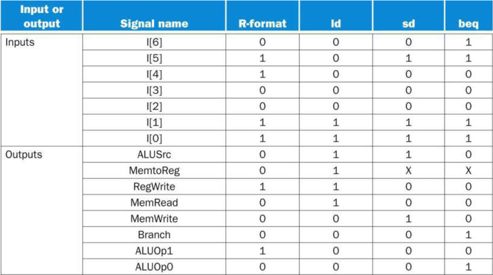

# Control

The control function for the simple single-cycle implementation is completely specified by this truth table.



The top half of the table gives the combinations of input signals that correspond to the four instruction classes, one per column, that determine the control output settings.
The bottom portion of the table gives the outputs for each of the four opcodes. Thus, the output RegWrite is asserted for two different combinations of the inputs.
If we consider only the four opcodes shown in this table, then we can simplify the truth table by using don’t cares in the input portion.
For example, we can detect an R-format instruction with the expression Op4 ∙ Op5, since this is sufficient to distinguish the R-format instructions from ld, sd, and beq.
We do not take advantage of this simplification, since the rest of the RISC-V opcodes are used in a full implementation.

## Testbench Result

```text
add              00100010
ld               11110000
sd               1x001000
beq              0x000101
ILLEGAL OP       xxxxxxxx
```
