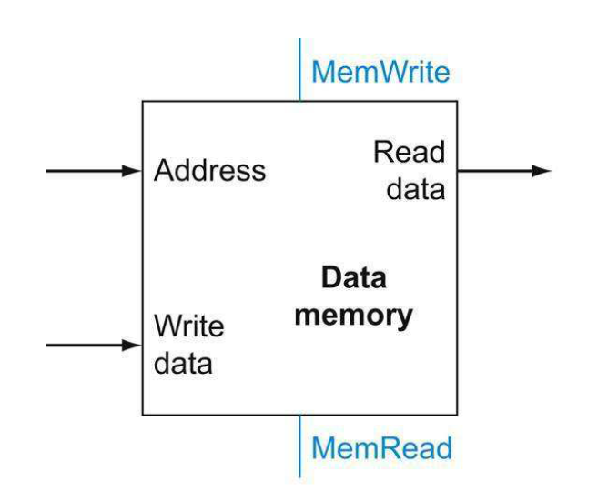

# Data Memory

The memory unit is a state element with inputs for the address and the write data, and a single output for the read result.

There are separate read and write controls, although only one of these may be asserted on any given clock.

The memory unit needs a read signal, since, unlike the register file, reading the value of an invalid address can cause problems.



## Testbench Result

To see the result of written testbench, use this commands:

```text
iverilog -o data_memory_tb.vvp data_memory_tb.v
vvp data_memory_tb.vvp
gtkwave
```
