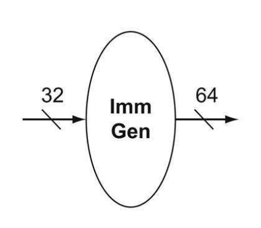

# Immediate Generation

The immediate generation unit (ImmGen) has a 32-bit instruction as input that selects a 12-bit field for load, store, and branch if equal that is sign-extended into a 64-bit result appearing on the output.



## Testbench Result

```text
immOut = 0000000000000000000000000000000000000000000000000000000011110000
immOut = 0000000000000000000000000000000000000000000000000000000011110000
immOut = 0000000000000000000000000000000000000000000000000000001111101000
```
