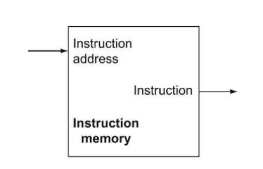

# Instruction Memory

The instruction memory need only provide read access because the datapath does not write instructions.

Since the instruction memory only reads, we treat it as combinational logic:

the output at any time reflects the contents of the location specified by the address input, and no read control signal is needed. (We will need to write the instruction memory when we load the program; this is not hard to add, and we ignore it for simplicity.)



We use [instruction_memory_tb.dat](./instruction_memory_tb.dat) file; for initialization of RAM.

## Testbench Result

To see the result of written testbench, use this commands:

```text
iverilog -o instruction_memory_tb.vvp instruction_memory_tb.v
vvp instruction_memory_tb.vvp
gtkwave
```
