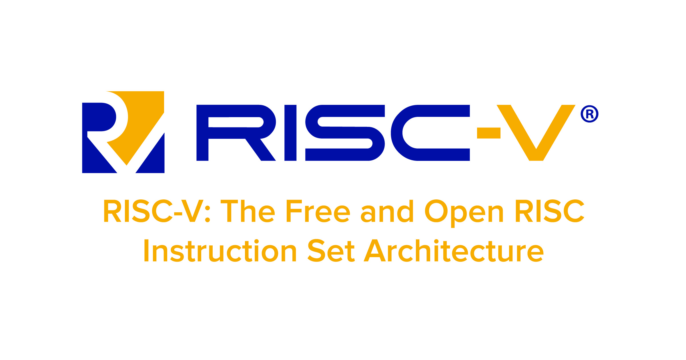

# RISC-V CPU

RISC-V is an open standard instruction set architecture (ISA) based on established reduced instruction set computer (RISC) principles.

Unlike most other ISA designs, the RISC-V ISA is provided under open source licenses that do not require fees to use.

A number of companies are offering or have announced RISC-V hardware, open source operating systems with RISC-V support are available and the instruction set is supported in several popular software toolchains.

For more information, see [this link](https://en.wikipedia.org/wiki/RISC-V).



In this section, we will construct, test and simulate a simple RISC-V CPU.


## Testbench Result

To see the result of written testbench, use this commands:

```text
iverilog -o cpu_tb.vvp cpu_tb.v
vvp cpu_tb.vvp
gtkwave
```
